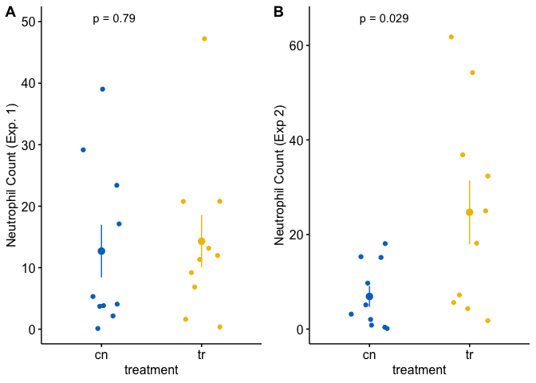

```r
set.seed(4)
n <- 10
fake_data <- data.table(
    treatment = rep(c("cn", "tr"), each = n),
    neutrophil_count_exp1 = rnegbin(n*2, 
                                    mu = rep(c(10, 15), each = n),
                                    theta = 1),
    neutrophil_count_exp2 = rnegbin(n*2, 
                                    mu = rep(c(10, 20), each = n),
                                    theta = 1)
)
View(fake_data)
```


```r
gg_1 <- ggstripchart(data = fake_data,
                x = "treatment",
                y = "neutrophil_count_exp1",
                color = "treatment",
                palette = "jco",
                add = "mean_se",
                legend = "none") +
    ylab("Neutrophil Count (Exp. 1)") +
  stat_compare_means(method = "t.test",
                     label.y = 50,
                     label = "p.format") +
    NULL

gg_2<- ggstripchart(data = fake_data,
                x = "treatment",
                y = "neutrophil_count_exp2",
                color = "treatment",
                palette = "jco",
                add = "mean_se",
                legend = "none") +
  ylab("Neutrophil Count (Exp 2)") +
  stat_compare_means(method = "t.test",
                     label.y = 65,
                     label = "p.format") +
NULL

plot_grid(gg_1, gg_2, labels = "AUTO")
```

<!-- -->


